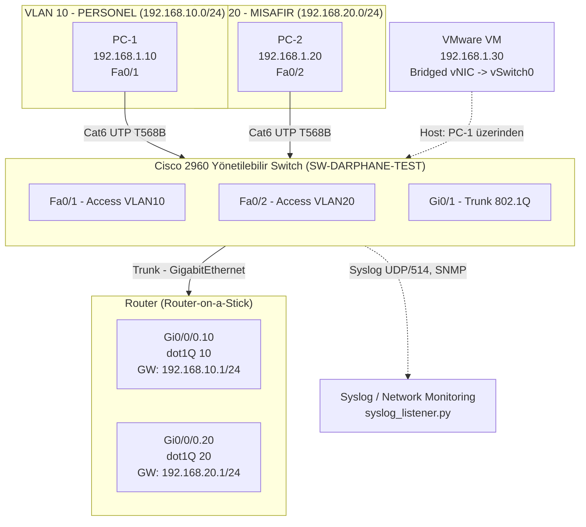

# Ağ Topolojisi ve VLAN Şeması

## Fiziksel / Mantıksal Topoloji

## VLAN Tablosu

| VLAN ID | İsim | Amaç | Örnek Host IP | Gateway (Sub-interface) |
|---|---|---|---|---|
| 1 | default | Yönetim SVI | 192.168.1.2/24 | — |
| 10 | PERSONEL | Kurum içi personel cihazları | 192.168.1.10 → 192.168.10.x | 192.168.10.1/24 |
| 20 | MISAFIR | Ziyaretçi/misafir cihazları (izole) | 192.168.1.20 → 192.168.20.x | 192.168.20.1/24 |

## Katman Bazlı Akış (OSI)

1. **Katman 1 (Fiziksel):** Cat6 UTP T568B kablolama, LED link/activity durumları, Auto-Negotiation ile 1 Gbps / Full-Duplex senkronizasyon.
2. **Katman 2 (Veri Bağı):** Switch CAM (MAC Address) tablosu, VLAN'lar arası izolasyon, 802.1Q trunk etiketleme, Port Security (sticky MAC).
3. **Katman 3 (Ağ):** IPv4 statik adresleme, Router-on-a-Stick ile Inter-VLAN Routing, ICMP (ping/tracert) doğrulaması.
4. **Katman 7 (Uygulama):** SMB (TCP/445) dosya paylaşımı testleri, RDP (TCP/3389) ve SSH (TCP/22) yönetim erişimi.
